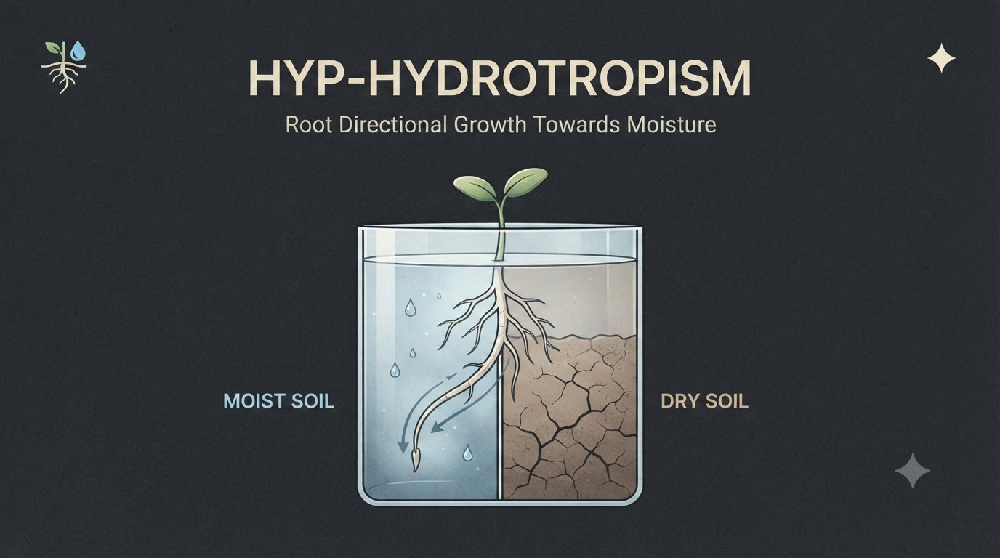

# Hydrotropism Simulator 💧

  

A clean, interactive educational web simulation modeling plant root hydrotropism. Explore how plant roots perceive and bend toward moisture gradients, balancing hydrotropic response against other environmental directional cues.

---

## ✨ Features

* **Moisture Gradient:** Simulate distinct moist and dry soil compartments to observe directional root bending toward water sources.
* **Interactive Controls:** Adjust moisture levels and simulation parameters in real time.
* **Growth Visualization:** Watch root curvature develop progressively as hydrotropic signals override standard vertical growth paths.
* **Reset Functionality:** Instantly reset the simulation to test different soil moisture hypotheses.

---

## 🚀 Built With & Hosted On

* **Repository:** GitHub
* **Hosting:** GitHub Pages
  
---

## 🛠️ Credits & Acknowledgments

* **Claude Sonnet:** Debugging, Code Generation & Architecture
* **Replit:** Code Improvisation & Rapid Prototyping
* **OpenAI:** Bug Fixes & Logic Optimization

---

## 👤 Author

* **Draven Ashcroft**
  * M.Sc. Ag. Entomology, ASRB NET
  * DIPS Chain Of Institutions

---
